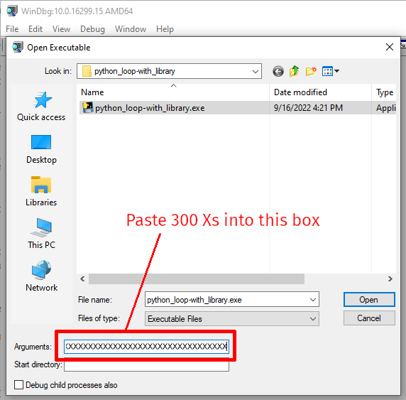

# asminject.py examples - Python - Extract Python code from a running process and decompile it

<a href="../README.md">[ Back to the main README.md ]</a> - <a href="examples-python.md">[ Back to Python examples ]</a>

* [Extract Python code from a running Python process](#extract-python-code-from-a-running-python-process)
* [Extract and Decompile Python code from a running PyInstaller-based process](#extract-and-decompile-python-code-from-a-running-pyinstaller-based-process)
* [Automated source code tree reconstruction](#automated-source-code-tree-reconstruction)
* [Stripped PyInstaller binaries](#stripped-pyinstaller-binaries)
* [Reconstructing source code from Windows PyInstaller binaries](#reconstructing-source-code-from-windows-pyinstaller-binaries)

## Extract Python code from a running Python process

Often, using a standard Python decompilation tool such as [Decompyle++](https://github.com/zrax/pycdc), [Uncompyle6](https://github.com/rocky/python-uncompyle6), or [Decompyle3](https://github.com/rocky/python-decompile3) against files on disk (e.g. `.pyc` files) will meet your needs. If so, you should probably go ahead and do that. But sometimes those tools can't parse the files you have access to, or the content no longer exists on disk and is only present in memory.

The `tools/python` directory of the `asminject.py` repository contains a Python script named `recursive_marshal.py` that will attempt to dump just about everything it can about a Python (including PyInstaller-generated binary) process. It is hardcoded to write output to a directory tree beginning with `/tmp/marshalled`, so edit the `recursive_marshal_base_dir` variable if you'd like it to go somewhere else. It should work with both Python 2 and 3, although it may require modifications for older minor releases.

Pass the entire script to `asminject.py` using the `--var-from-file` option, e.g.:

```
# python3 ./asminject.py 237465 execute_python_code.s --relative-offsets-from-binaries --var-from-file pythoncode tools/python/recursive_marshal.py
```

If the target process is a regular Python script running in a Python interpreter, the output should include the original source code for any loaded modules. For example, consider the following output when the script was injected into used against the `practice/python_loop-with_library.py` script:
```
Wrote entire source code for object __main__/example_python_library/important_thing to /tmp/marshalled/__main__/example_python_library/important_thing/___exported_object_source___.py
```

In this case, the exported data contains the entire original content of the `example_python_library/important_thing.py` script:

```
% cat /tmp/marshalled/__main__/example_python_library/important_thing/___exported_object_source___.py

important_thing_secret_value = "A very secret value that is only defined in example_python_library/important_thing.py"

class important_class_1:
    def __init__(self):
        self.important_hardcoded_value = "A very secret value that is only defined in the __init__ function for important_class_1 in example_python_library/important_thing.py"
    
    def ic1_print_ihv(self):
        print(self.important_hardcoded_value)
    
    @staticmethod
    def ic1_static_print_ihv():
        print("A very secret value that is only defined in the static_print_ihv function for important_class_1 in example_python_library/important_thing.py")

def it_print_itsv():
    print(important_thing_secret_value)

@staticmethod
def it_static_print_itsv():
    print("A very secret value that is only defined in example_python_library/important_thing.py's static method it_static_print_itsv")
```

The exported content will also include a lot of additional data, such as JSON definitions of object trees, source code for individual functions, and so on. This information is typically not necessary when the target process is a regular Python script running in a Python interpreter, but is important for other cases, and discussed further below.

The [Automated source code tree reconstruction](#automated-source-code-tree-reconstruction) section, below, describes a scripted process that attempts to reconstruct the original source code tree from the exported data.

## Extract and Decompile Python code from a running PyInstaller-based process

[PyInstaller](https://pyinstaller.org/) strips the source code property from objects, but there is still enough metadata left to reconstruct most of the same information from a process running in memory.

For example, generate a PyInstaller package for the example Python script that references a library:

```
# pip3 install pyinstaller

# cd practice

# pyinstaller python_loop-with_library.py
```

Launch the resulting `dist/python_loop-with_library/python_loop-with_library` binary and locate the process ID:

```
# ps auxww | grep python_loop                                                                                            
user      237465  [...] practice/dist/python_loop-with_library/python_loop-with_library
```

The process is virtually identical to extracting content from a regular Python process, e.g.:

```
# python3 ./asminject.py  237465 execute_python_code.s --relative-offsets-from-binaries --var-from-file pythoncode tools/python/recursive_marshal.py
```

For PyInstaller binaries, the source code will most likely not be present, and so the output will look like this:

```
...omitted for brevity...
Couldn't get source code for __main__
Writing code to /tmp/marshalled/__main__/_pyi_main_co.bin
Couldn't get source code for __main__
Writing code to /tmp/marshalled/__main__/dump_code_object.bin
Couldn't get source code for __main__
Writing code to /tmp/marshalled/__main__/escape_json_value.bin
Couldn't get source code for __main__/example_python_library/important_thing/important_class_1
Writing code to /tmp/marshalled/__main__/example_python_library/important_thing/important_class_1/__init__.bin
Couldn't get source code for __main__/example_python_library/important_thing/important_class_1
Writing code to /tmp/marshalled/__main__/example_python_library/important_thing/important_class_1/ic1_print_ihv.bin
Couldn't get source code for __main__/example_python_library/important_thing/important_class_1
Writing code to /tmp/marshalled/__main__/example_python_library/important_thing/important_class_1/ic1_static_print_ihv.bin
Couldn't get source code for __main__/example_python_library/important_thing
Writing code to /tmp/marshalled/__main__/example_python_library/important_thing/it_print_itsv.bin
Couldn't get source code for __main__
Writing code to /tmp/marshalled/__main__/iteratively_dump_object.bin
...omitted for brevity...
```

In this case, you can use [Decompyle++](https://github.com/zrax/pycdc) on the binary files, looking in the corresponding JSON file to determine the Python major and minor version (3.10 in this case):

```
% jq . /tmp/marshalled/__main__/example_python_library/important_thing/important_class_1/ic1_static_print_ihv.json \
	| grep -P '(marshalled_file|python_version)'

  "marshalled_file": "/tmp/marshalled/__main__/example_python_library/important_thing/important_class_1/ic1_static_print_ihv.bin",
  "python_version": "sys.version_info(major=3, minor=10, micro=5, releaselevel='final', serial=0)"

% pycdc -c -v 3.10 /tmp/marshalled/__main__/example_python_library/important_thing/important_class_1/ic1_static_print_ihv.bin

...omitted for brevity...
print('A very secret value that is only defined in the static_print_ihv function for important_class_1 in example_python_library/important_thing.py')
```

The marshalled binary version of code from the main/initial script should be located in `__main__/_pyi_main_co.bin`, e.g.:

```
% pycdc -c -v 3.10 /tmp/marshalled/__main__/_pyi_main_co.bin
 
...omitted for brevity...
import time
import datetime
import example_python_library
import example_python_library.important_thing as example_python_library
example_global_var_1 = 'AKIASADF9370235SUAS0'
example_global_var_2 = 'This value should not be disclosed'
for i in range(0, 1000000):
    print(datetime.datetime.utcnow().isoformat() + ' - Loop count ' + str(i))
    time.sleep(5)
```

Interesting properties may also be found in the JSON-formatted object tree exports, e.g.:

```
% jq . /tmp/marshalled/__main__/___exported_object_metadata___.json

{
...omitted for brevity...
"example_global_var_1": "AKIASADF9370235SUAS0",
"example_global_var_2": "This value should not be disclosed",
...omitted for brevity...
```

The [Automated source code tree reconstruction](#automated-source-code-tree-reconstruction) section, below, describes a scripted process that attempts to reconstruct the original source code tree from the exported data.

It's also possible to perform a more targeted analysis without the lengthy custom script, e.g.:

```
# python3 ./asminject.py 153818 execute_python_code.s \
	--relative-offsets-from-binaries \
	--var pythoncode 'for name, obj in inspect.getmembers(sys.modules[__name__]):\n    print(f\"{name}\\t{obj}\");'
```

```
2022-09-09T01:27:25.327239 - Loop count 201
...omitted for brevity...
__file__	/[REDACTED]practice/dist/python_loop/python_loop.py
__loader__	<pyimod02_importers.FrozenImporter object at 0x7f2078888880>
__name__	__main__
...omitted for brevity...
_pyi_main_co	<code object <module> at 0x7f20788a33c0, file "python_loop.py", line 1>
...omitted for brevity...
example_global_var_1	AKIASADF9370235SUAS0
example_global_var_2	This value should not be disclosed
i	201
...omitted for brevity...
2022-09-09T01:27:33.372971 - Loop count 202
```

To retrieve and decompile only the main script:

```
# python3 ./asminject.py 153818 execute_python_code.s \
	--relative-offsets-from-binaries \
	--var pythoncode 'import marshal\nobj_counter = 0\nfor name, obj in inspect.getmembers(sys.modules[__name__]):\n    obj_counter +=1\n    if name in [\"_pyi_main_co\"]:\n        out_name=os.path.abspath(f\"{obj_counter}-{obj.co_filename}.bin\")\n        print(f\"Writing code object to {out_name}\")\n        with open(out_name, \"wb\") as marshal_file:\n            marshal.dump(obj, marshal_file)'
```

```
...omitted for brevity...
2022-09-09T01:58:11.011195 - Loop count 559
Writing code object to /[REDACTED]/practice/14-python_loop.py.bin
2022-09-09T01:58:20.127165 - Loop count 560
...omitted for brevity...
```

```
pycdc -v 3.10 -c /[REDACTED]/practice/14-python_loop.py.bin
# Source Generated with Decompyle++
# File: 14-python_loop.py.bin (Python 3.10)
...omitted for brevity...
import time
import datetime
example_global_var_1 = 'AKIASADF9370235SUAS0'
example_global_var_2 = 'This value should not be disclosed'
for i in range(0, 1000000):
    print(datetime.datetime.utcnow().isoformat() + ' - Loop count ' + str(i))
    time.sleep(5)
```

## Automated source code tree reconstruction

The combination of data output by the marshalling script and Decompyle++ can be used to reconstruct an approximation of the original source code tree in the style of [This Dust Remembers What It Once Was](https://www.beneaththewaves.net/Software/This_Dust_Remembers_What_It_Once_Was.html), via the `tools/python/reconstruct_source.py` script include in this repository. Please note that `reconstruct_source.py` is currently an alpha-quality prototype, but it does produce very useful output.

Note: until the upstream package maintainer merges in my recursion-limiting code, you should use [my customized fork of Decompyle++](https://github.com/blincoln-bf/pycdc) to avoid the process running out of memory and locking up when it encounters problematic code.

If the data extracted by the script includes embedded source code, `reconstruct_source.py` will prefer that, as it's generally identical to the original. It's also much more straightforward to retrieve the entire source for a given module all at once. For example, using the output of the `recursive_marshal.py` script for `python_loop-with_library.py` running in Python 2.7, the source code is identical :

```
% python3 tools/python/reconstruct_source.py --input-dir /tmp/marshalled \
	--output-dir /home/user/reconstructed \
	--pycdc-path /home/user/pycdc/pycdc

reconstruct_source.py
v0.2
Ben Lincoln, Bishop Fox, 2022-09-15
...omitted for brevity...

% cat /home/user/reconstructed/___base_path___/practice/example_python_library/important_thing.py 
# Module name: example_python_library.important_thing
# Package: None
# Original file path: /[REDACTED]/practice/example_python_library/important_thing.pyc

"""This is the description in example_python_library/important_thing.py"""

important_thing_secret_value = "A very secret value that is only defined in example_python_library/important_thing.py"

class important_class_1:
    class_variable_1 = "this is a class variable"

    def __init__(self):
        """This is the description in important_class_1.__init__()"""
        self.important_hardcoded_value = "A very secret value that is only defined in the __init__ function for important_class_1 in example_python_library/important_thing.py"
    
    def ic1_print_ihv(self):
        """This is the description in important_class_1.ic1_print_ihv()"""
        print(self.important_hardcoded_value)
    
    @staticmethod
    def ic1_static_print_ihv():
        """This is the description in important_class_1.ic1_static_print_ihv()"""
        print("A very secret value that is only defined in the static_print_ihv function for important_class_1 in example_python_library/important_thing.py")

def it_print_itsv():
    """This is the description in important_thing.it_print_itsv()"""
    print(important_thing_secret_value)

@staticmethod
def it_static_print_itsv():
    """This is the description in important_thing.it_static_print_itsv()"""
    print("A very secret value that is only defined in example_python_library/important_thing.py's static method it_static_print_itsv")
```

If the data does not contain embedded source code, the script uses the metadata and Decompyle++ to reconstruct the source code instead.

For example, using the output generated previously for the PyInstaller-packaged version of `python_loop-with_library.py`, the source code is virtually identical to the original source, except that class- and function-level doc strings are missing, and the script is not able to differentiate between class-level static methods and regular functions.

```
% python3 tools/python/reconstruct_source.py --input-dir /tmp/marshalled \
	--output-dir /home/user/reconstructed \
	--pycdc-path /home/user/pycdc/pycdc

reconstruct_source.py
v0.2
Ben Lincoln, Bishop Fox, 2022-09-15
...omitted for brevity...

% cat /home/user/reconstructed/___base_path___/practice/dist/python_loop-with_library/example_python_library/important_thing.py

# Module name: example_python_library.important_thing
# Package: example_python_library
# Original file path: /mnt/hgfs/c/Users/blincoln/Documents/Projects/Research/asminject/Memory_Injection_Code/asminject/devel-2022-05-05-01/practice/dist/python_loop-with_library/example_python_library/important_thing.pyc
"""This is the description in example_python_library/important_thing.py"""


important_thing_secret_value = "A very secret value that is only defined in example_python_library/important_thing.py"

class important_class_1:

    class_variable_1 = "this is a class variable"

    def __init__(self):
        self.important_hardcoded_value = 'A very secret value that is only defined in the __init__ function for important_class_1 in example_python_library/important_thing.py'

    def ic1_print_ihv(self):
        print(self.important_hardcoded_value)

    def ic1_static_print_ihv():
        print('A very secret value that is only defined in the static_print_ihv function for important_class_1 in example_python_library/important_thing.py')

def it_print_itsv():
    print(important_thing_secret_value)

@staticmethod
def it_static_print_itsv():
    print("A very secret value that is only defined in example_python_library/important_thing.py's static method it_static_print_itsv")
```

### Known limitations

There are some limitations in the current version of the script:

#### Code injection artifacts

The reconstructed version of the main script will contain the full content of the recursive-marshalling script. A future version may automatically remove it.

#### Circular references

If a circular reference exists somewhere in the description of an object, Python will throw an exception along the lines of:

```
maximum recursion depth exceeded while getting the repr of an object
```

...or...

```
maximum recursion depth exceeded while getting the str of an object
```

...when tryinvour()
```

The scripts will reconstruct these two statements as:
g to generate the string/numeric representation of the object that the marshalling script uses to build its JSON output.

This will cause function/method signatures to appear as `(<unknown>)`, and other values to appear as `"Unable to represent this value as a string"`.

I'm not aware of a good workaround for this, but would be happy to hear about any.

#### Object representation

If an object is instantiated directly in a module or class (as opposed to in a function or method), *and* the code is being reconstructed from marshalled binary data, this process will currently reconstruct the statement incorrectly. For example, from the Python `pathlib.py` module's source code:

```
_windows_flavour = _WindowsFlavour()
_posix_flavour = _PosixFla
```
_windows_flavour = "<pathlib._WindowsFlavour object at 0x7f4fff561ba0>"
_posix_flavour = "<pathlib._PosixFlavour object at 0x7f4fff3ce800>"
```

This is because right now, I don't actually know where the code objects associated with those statements are stored in memory, and so the scripts are reconstructing the statements from the presence of the objects in the attributes for the class or module. I'm sure the code objects are in there somewhere, I just haven't found them yet.

## Stripped PyInstaller binaries

Does including the `-s` / `--strip` option when building with PyInstaller prevent injecting new Python code into the process?

```
# pyinstaller --distpath dist-linux -s python_loop-with_library.py

858 INFO: PyInstaller: 5.3
859 INFO: Python: 3.10.5
863 INFO: Platform: Linux-5.18.0-kali2-amd64-x86_64-with-glibc2.33
...omitted for brevity...
19332 INFO: Executing - strip/root/.cache/pyinstaller/bincache10_py310_64bit/libcrypto.so.3
19440 INFO: Executing - strip/root/.cache/pyinstaller/bincache10_py310_64bit/liblzma.so.5
19481 INFO: Executing - strip/root/.cache/pyinstaller/bincache10_py310_64bit/libbz2.so.1.0
19541 INFO: Executing - strip/root/.cache/pyinstaller/bincache10_py310_64bit/libssl.so.3
19705 INFO: Executing - strip/root/.cache/pyinstaller/bincache10_py310_64bit/libpython3.10.so.1.0
19840 INFO: Building COLLECT COLLECT-00.toc completed successfully.

# readelf -a --wide dist-linux/python_loop-with_library/libpython3.10.so.1.0 | grep PyEval

...omitted for brevity...
664: 00000000001bd3e0   272 FUNC    GLOBAL DEFAULT   12 PyEval_EvalCode
...omitted for brevity...
```

Looks like the symbols `asminject.py` needs are still there, but does injecting code actually work?

```
% practice/dist-linux/python_loop-with_library/python_loop-with_library 
2022-09-16T23:34:23.932177 - Loop count 0
```

```
# ps auxww | grep python_loop 

user      945132  [...] practice/dist-linux/python_loop-with_library/python_loop-with_library

# python3 ./asminject.py 945132 execute_python_code.s \
	--relative-offsets-from-binaries --var-from-file pythoncode tools/python/recursive_marshal.py
...omitted for brevity...
```

```
2022-09-16T23:34:28.938222 - Loop count 1
...omitted for brevity...
Couldn't get source code for function __main__/example_python_library/ExampleClass
Writing function code to /tmp/marshalled/__main__/example_python_library/ExampleClass/__init__.bin
Couldn't get source code for function __main__/example_python_library/ExampleClass
Writing function code to /tmp/marshalled/__main__/example_python_library/ExampleClass/ec_static_method_1.bin
Couldn't get source code for function __main__/example_python_library
Writing function code to /tmp/marshalled/__main__/example_python_library/ExampleFunction.bin
Couldn't get source code for routine __main__/example_python_library
Writing routine code to /tmp/marshalled/__main__/example_python_library/ExampleStaticMethod.bin
...omitted for brevity...
```

Maybe injection is possible but the source code tree reconstruction script will fail?

```
% python3 tools/python/reconstruct_source.py \
	--input-dir /tmp/marshalled \
	--output-dir /home/user/reconstructed-08-py3installer-stripped-linux \
	 --pycdc-path /home/user/pycdc/pycdc
	 
...omitted for brevity...
Processing module at '/tmp/marshalled/example_python_library.important_thing'
Processing class at '/tmp/marshalled/example_python_library.important_thing/important_class_1'
Processing function at '/tmp/marshalled/example_python_library.important_thing/important_class_1/__init__.json'
Processing function at '/tmp/marshalled/example_python_library.important_thing/important_class_1/ic1_print_ihv.json'
Processing function at '/tmp/marshalled/example_python_library.important_thing/important_class_1/ic1_static_print_ihv.json'
Processing function at '/tmp/marshalled/example_python_library.important_thing/it_print_itsv.json'
Processing routine at '/tmp/marshalled/example_python_library.important_thing/it_static_print_itsv.json'
...omitted for brevity...

 % cat /home/user/reconstructed-08-py3installer-stripped-linux/___base_path___/practice/dist-linux/python_loop-with_library/example_python_library/important_thing.py

# Module name: example_python_library.important_thing
# Package: example_python_library
# Original file path: /[REDACTED]/practice/dist-linux/python_loop-with_library/example_python_library/important_thing.pyc
"""This is the description in example_python_library/important_thing.py"""


important_thing_secret_value = "A very secret value that is only defined in example_python_library/important_thing.py"

class important_class_1:

    class_variable_1 = "this is a class variable"

    def __init__(self):
        self.important_hardcoded_value = 'A very secret value that is only defined in the __init__ function for important_class_1 in example_python_library/important_thing.py'

    def ic1_print_ihv(self):
        print(self.important_hardcoded_value)

    def ic1_static_print_ihv():
        print('A very secret value that is only defined in the static_print_ihv function for important_class_1 in example_python_library/important_thing.py')

def it_print_itsv():
    print(important_thing_secret_value)

@staticmethod
def it_static_print_itsv():
    print("A very secret value that is only defined in example_python_library/important_thing.py's static method it_static_print_itsv")
```

Guess that has no effect on Linux builds. PyInstaller crashes when I add that flag on Windows, so I don't know for sure about that platform. Wait, this works on Windows too?

## Reconstructing source code from Windows PyInstaller binaries

There is currently no Windows support in `asminject.py`, so you'll need to inject one of the recursive-marshalling scripts into the target process using other means. The steps below use [WinDbg](https://learn.microsoft.com/en-us/windows-hardware/drivers/debugger/getting-started-with-windbg), which is included with every version of the Windows SDK.

Before launching WinDbg, make sure to create the directory `C:\Symbols`, if it doesn't already exist.

WinDbg can call arbitrary functions that exist in the process it's attached to. However, it needs to not only know the address of the function, but its signature, and the signature is not included by default in the Python DLL. There are several ways of remedying this. I found the fastest way to be finding functions in other libraries already loaded by the process that have identical signatures (or at least close enough), and using those with the `/s` (prototype) option for `.call`.

To inject code like `asminject.py` does, that means that the following signatures are required:

* `PyGILState_Ensure()`: no parameters, returns an integer
* `PyRun_SimpleString(char * command)`: Python script code to execute passed as a pointer to a string, returns an integer
* `PyGILState_Release(int handle)`: releases the handle returned by `PyGILState_Ensure()`

If you don't care about keeping the target process more or less stable, you can omit the third one.

When examining a basic PyInstaller binary built using Python 3.9 and the `python_loop-with_library.py` script included in this repo, I used the following prototype functions:

* For `PyGILState_Ensure()`, I used `VCRUNTIME140!_GetImageBase`.
* For `PyRun_SimpleString(char * command)`, I didn't find any functions with signatures in any of the loaded libraries that accepted a single `char *` parameter. Fortunately, all that really mattered was that it accepted a single pointer parameter, so I used `VCRUNTIME140!__GetPlatformExceptionInfo`, which has a single `int *` parameter.
* For `PyGILState_Release(int handle)`, the closest match I found was `VCRUNTIME140!UnDecorator::getFloatingPoint`, which accepts a single integer parameter, but returns a complex structure. This meant that WinDbg would output a nonsense parsing of the return value, but that was a harmless side-effect.

When repeating this process with a completely different Python 3.9 PyInstaller package from a third-party product, almost none of the libraries it had loaded were the same (most likely because it was built using a 32-bit x86 version of Python 3.9 instead of x86-64). For that one, I used the following prototypes:

* For `PyGILState_Ensure()`, I used `mfc140u!GetCmdMgr`.
* For `PyRun_SimpleString(char * command)`, I used `ole32!MakeGlobal`.
* For `PyGILState_Release(int handle)`, I used `mfc140u!CWnd::CancelToolTips`.

If you need to find prototypes yourself, the easiest approach I've found is to have WinDbg log to a file (`Edit` => `Open/Close Log File`), run the `x *!*` WinDbg command, then grep through the log file for `(void)`, `(char *)` (and, if necessary, `(int *)`, `(long *)`, and so on), and `(int)`.

The other requirement is a location in memory to write the injected Python code. `asminject.py` does this dynamically. For this WinDbg process, you'll need about 300 bytes of data that can be safely overwritten. If you are able to launch a new instance of the target binary using WinDbg, this is easily achieved by starting it with an additional command line argument consisting of 300 Xs. If you need to attach to an existing process instead, you'll have to get more creative. Maybe use another tool to inject a DLL that you won't actually use, and overwrite part of it? The remainder of this section assumes that you're launching the process from WinDbg, and including the placeholder command line argument.

After starting WinDbg, go to the `File` menu and choose `Open Executable`. Browse to the binary and select it, but don't open it yet. Before opening it, paste 300 `X` characters into the `Arguments` field, as shown below:



Here are 300 Xs ready to go:

```
XXXXXXXXXXXXXXXXXXXXXXXXXXXXXXXXXXXXXXXXXXXXXXXXXXXXXXXXXXXXXXXXXXXXXXXXXXXXXXXXXXXXXXXXXXXXXXXXXXXXXXXXXXXXXXXXXXXXXXXXXXXXXXXXXXXXXXXXXXXXXXXXXXXXXXXXXXXXXXXXXXXXXXXXXXXXXXXXXXXXXXXXXXXXXXXXXXXXXXXXXXXXXXXXXXXXXXXXXXXXXXXXXXXXXXXXXXXXXXXXXXXXXXXXXXXXXXXXXXXXXXXXXXXXXXXXXXXXXXXXXXXXXXXXXXXXXXXXXXX

```

Open the binary. From the `Debug` menu, select `Go`.

Wait for the target process to reach a state where all code of interest has been loaded. Then go to the `Debug` menu and choose `Break`.

Run the following two commands in WinDbg to load symbols for libraries:

```
.symfix+ c:\symbols
.reload
```

Locate the command-line parameters for the process using the `!peb` WinDbg command. The data of interest is the `ProcessParameters` address, which should have the full `CommandLine` value a few lines after it, and that line should contain your 300 Xs.

```
0:004> !peb
PEB at 000000dc7a765000
...omitted for brevity...
ProcessParameters: 000002a8165f27e0
...omitted for brevity...
CommandLine:  'C:\[REDACTED]\practice\dist-win-unstripped\python_loop-with_library\python_loop-with_library.exe XXXXXXXX[...]XXXXXXXX'
```

In this example output, `ProcessParameters` is at address `0x000002a8165f27e0`. That value will change on every execution of the binary, so don't just assume it will be the same for you.

Use the WinDbg search-in-memory functionality to find the beginning of the 300 Xs string starting at the `ProcessParameters` address:

```
0:004> s -a 000002a8165f27e0 L?100000 XXXXXXXX

000002a8`165f489f  58 58 58 58 58 58 58 58-58 58 58 58 58 58 58 58  XXXXXXXXXXXXXXXX
000002a8`165f48a0  58 58 58 58 58 58 58 58-58 58 58 58 58 58 58 58  XXXXXXXXXXXXXXXX
...omitted for brevity...
```

In this example, the string of Xs starts at `0x000002a8165f489f`, but that will also change every time the binary is executed.

If you don't get any results, or the results are outside of accessible memory for the target process, try searching using UTF-16 instead, e.g. for a 32-bit x86 PyInstaller process:

```
0:008> !peb

PEB at 01138000
...omitted for brevity...
    ProcessParameters: 014521b0
...omitted for brevity...
    CommandLine:  '"C:\Program Files (x86)\Druva\inSync\7.2.1\inSync.exe" XXXXXXXXXXXXXXXXXXXXXXXXXXXXXXXXXXXXXXXXXXXXXXXXXXXXXXXXXXXXXXXXXXXXXXXXXXXXXXXXXXXXXXXXXXXXXXXXXXXXXXXXXXXXXXXXXXXXXXXXXXXXXXXXXXXXXXXXXXXXXXXXXXXXXXXXXXXXXXXXXXXXXXXXXXXXXXXXXXXXXXXXXXXXXXXXXXXXXXXXXXXXXXXXXXXXXXXXXXXXXXXXXXXXXXXXXXXXXXXXXXXXXXXXXXXXXXXXXXXXXXXXXXXXXXXXXXXXXXXXXXXXXXXXXXXXXXXXXXX'
...omitted for brevity...

0:000> s -u 014521b0 L?100000 XXXXXXX
01452750  0058 0058 0058 0058 0058 0058 0058 0058  X.X.X.X.X.X.X.X.
01452752  0058 0058 0058 0058 0058 0058 0058 0058  X.X.X.X.X.X.X.X.
...omitted for brevity...
```

Modify the following string to replace `<ASMINJECT_REPO_PATH>` with the location of your copy of the `asminject.py` GitHub repo. Make sure every backslash you include is replaced with four backslashes, like the existing ones:

```
exec(open('C:\\\\<ASMINJECT_REPO_PATH>\\\\tools\\\\python\\\\recursive_marshal.py', 'r').read())
```

e.g.:

```
exec(open('C:\\\\Users\\\\blincoln\\\\Documents\\\\repos\\\\asminject\\\\tools\\\\python\\\\recursive_marshal.py', 'r').read())
```

Use the WinDbg `eza` (write ASCII C string) command to write the resulting string to the location where the 300 Xs start, e.g.:

```
0:004> eza 000002a8`165f489f "exec(open('C:\\\\Users\\\\blincoln\\\\Documents\\\\repos\\\\asminject\\\\tools\\\\python\\\\recursive_marshal.py', 'r').read())"
```

Optionally, verify that it was written successfully, e.g.:

```
0:004> da /c 8 000002a8`165f489f
000002a8`165f489f  "exec(ope"
000002a8`165f48a7  "n('C:\\U"
000002a8`165f48af  "sers\\bl"
000002a8`165f48b7  "incoln\\"
...omitted for brevity...
```

Edit the `recursive_marshal.py` script referenced in the string above to give it a base directory that's valid on Windows, e.g.:

```
recursive_marshal_base_dir = "C:\\Users\\blincoln\\AppData\\Local\\Temp\\marshalled"
```

Optionally, set up a breakpoint or two so that you can perform the rest of this work while the code is in a state that probably won't crash the target process, e.g:

```
bm /1 python39!PyEval_GetLocals
bm /1 python39!PyEval_GetGlobals
```

If you choose to use the breakpoint approach, go to the `Debug` menu and select `Go` at this point, then wait for one of the breakpoints to be triggered before proceeding. If you're forging ahead and don't care if the process crashes, just keep going with the rest of the steps.

Use the `.call` WinDbg command and `g` confirmation to execute the three functions, substituting your own prototype references if necessary. First, `PyGILState_Ensure()`:

```
0:004> .call /s VCRUNTIME140!_GetImageBase python39!PyGILState_Ensure()
*** ERROR: Symbol file could not be found.  Defaulted to export symbols for C:\[REDACTED]\practice\dist-win-unstripped\python_loop-with_library\python39.dll - 
Thread is set up for call, 'g' will execute.
WARNING: This can have serious side-effects,
including deadlocks and corruption of the debuggee.
0:004> g
.call returns:
unsigned int64 1

ntdll!DbgBreakPoint:
00007ff8`0b830af0 cc              int     3
```

The `unsigned int64 1` return value in the example above is the handle ID for the interpreter lock. In this case, the ID is `1`. Keep that handle for releasing the lock later.

Execute `PyRun_SimpleString`, passing it the address where you wrote the Python script string, e.g.:

```
0:004> .call /s VCRUNTIME140!__GetPlatformExceptionInfo python39!PyRun_SimpleString(0x000002a8165f489f)

Thread is set up for call, 'g' will execute.
WARNING: This can have serious side-effects,
including deadlocks and corruption of the debuggee.

0:004> g
```

The first time you call the function, you may get some output from the target process like this:

```
No module named 'inspect'
```

If there are any Python modules referenced by the recursive-marshalling script that weren't compiled into the PyInstaller binary, you'll need to copy them to the binary's working directory. Copy the module in the error message, then in WinDbg hit the up arrow key twice to go back to the `PyRun_SimpleString` call and re-run it by pressing enter. During my testing, I had to go through four cycles of copying a `.py` file into the working directory, then re-running the function call. In the end, I'd added four files:

* `inspect.py`
* `ast.py`
* `dis.py`
* `opcode.py`

Once the script has executed successfully, release the hold on the Python interpreter. The response will be interpreted as garbage if you use the same prototype that I did, but that doesn't matter.

```
0:004> .call /s VCRUNTIME140!UnDecorator::getFloatingPoint python39!PyGILState_Release(1)

Thread is set up for call, 'g' will execute.
WARNING: This can have serious side-effects,
including deadlocks and corruption of the debuggee.
0:004> g
.call returns:
class DName
   +0x000 node             : Ptr64 DNameNode
   +0x008 value            : Uint4B
...omitted for brevity...
```

From the `Debug` menu, select `Go`, and the process should continue operating normally.

The files can be copied from the output directory (`C:\Users\blincoln\AppData\Local\Temp\marshalled` in the example above) to a Linux system and processed using the `reconstruct_source.py` script discussed above, e.g.:

```
% python3 tools/python/reconstruct_source.py \
	--input-dir /mnt/hgfs/c/Users/blincoln/Documents/marshalled-win-03 \
	--output-dir /home/user/reconstructed-win-03 \
	--pycdc-path /mnt/hgfs/c/Users/blincoln/Documents/GitHub/pycdc-custom/build/pycdc \
	--input-path-replacement 'C:\\Users\\blincoln\\AppData\\Local\\Temp\\marshalled' \
	'/mnt/hgfs/c/Users/blincoln/Documents/marshalled-win-03' \
	--input-path-replacement 'C:' 'C' \
	--input-path-replacement '\\' '/'
```

