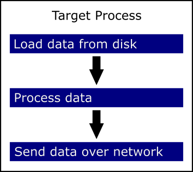
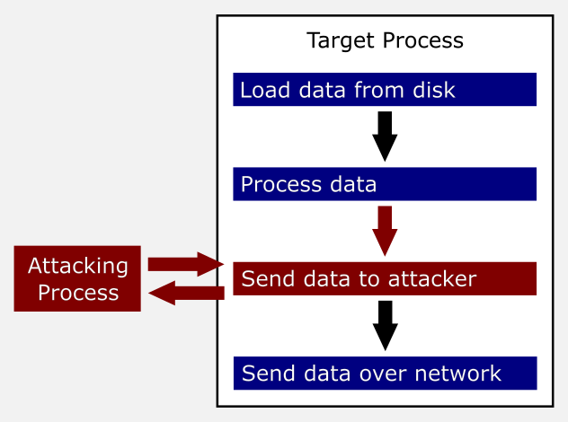
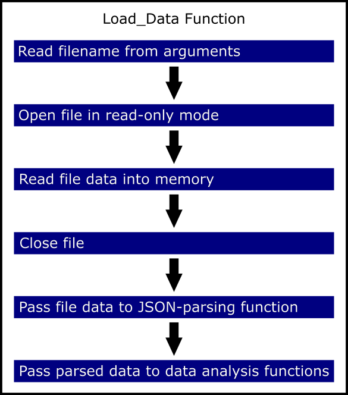
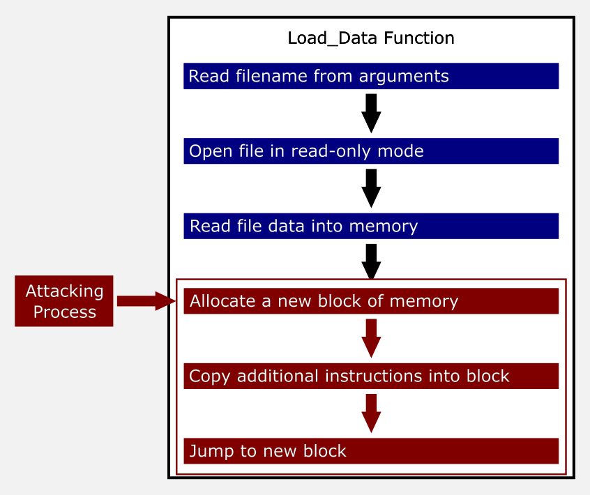
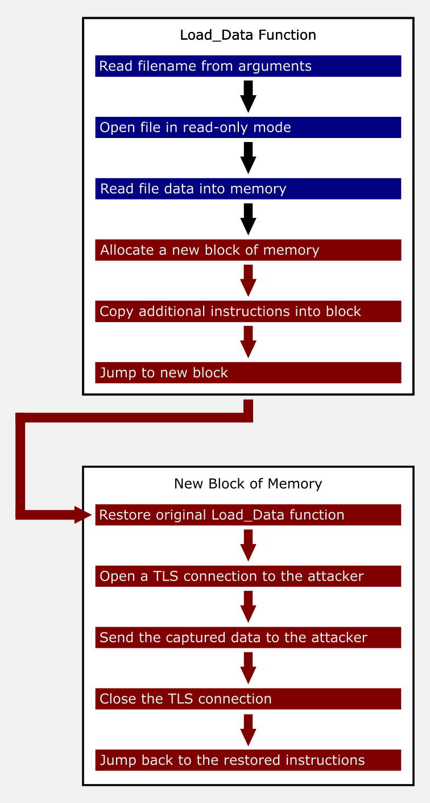
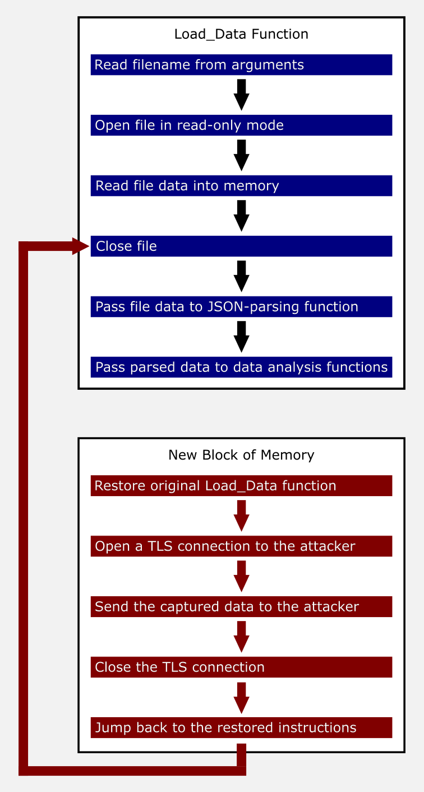
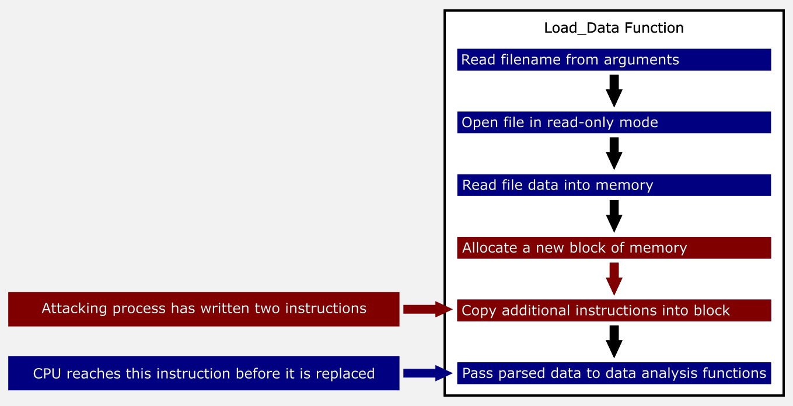

# How asminject.py works

<a href="../README.md">[ Back to the main README.md ]</a>

* [An introduction to code injection](#an-introduction-to-code-injection)
* [Reading and writing memory in another process](#reading-and-writing-memory-in-another-process)
* [Payload staging](#payload-staging)
* [Writeable versus executable memory](#writeable-versus-executable-memory)
* [Determining which code to overwrite](#determining-which-code-to-overwrite)
* [Building the code to inject](#building-the-code-to-inject)
* [Injecting code without destabilizing the target process](#injecting-code-without-destabilizing-the-target-process)
* [Communicating with the target process](#communicating-with-the-target-process)
* [Performing complex tasks inside the target process](#performing-complex-tasks-inside-the-target-process)
* [Cleaning up](#cleaning-up)
* [Obfuscation and anti-detection](#obfuscation-and-anti-detection)

## An introduction to code injection

Consider a hypothetical back-end/batch process that loads data from a file, processes it, and then sends it over the network to another system:



At a high level, code injection tools hijack the normal flow of execution to insert additional operations. In the diagram below, the batch process still performs its standard work, but the injected code also transmits a copy of the resulting data to the attacker:



You may be wondering "If the attacker has access to inject code into the process, why wouldn't they just copy the data from wherever the batch process is getting it?", and sometimes the answer is "that's probably exactly what the attacker would do", but sometimes tampering with an existing process is significantly easier. The process may be transparently decrypting the data using the permissions of the account it's running as. The code may be heavily obfuscated, and figuring out how to perform equivalent processing on the data might therefore be extremely complicated. The attacker might wish to help evade detection by establishing a persistent presence in a long-running process instead of attracting attention by starting a new process. The potential reasons are limitless. Most attackers will expend the least amount of effort necessary to achieve their goals, and sometimes the least amount of effort involves injecting new code into an existing process.

The "nuts and bolts" low-level view of the code-injection process is more complicated. Increasing the level of detail a bit, consider the following individual steps that might take place within just the "load data from disk" block from the first diagram:



When tampering with the memory of an existing process, the most significant initial building blocks are the ability to read existing data, or overwrite it with something else. Most complex functionality will be achieved by actual code that's written to memory. In modern computing systems, instructions typically need to be located in memory that's marked as executable, meaning that unless the attacker has performed a detailed analysis of the specific target binary, they're going to have to start out by overwriting some existing logic in the target process, but the more of the existing code is overwritten, the harder it will be to keep the target process stable during the injection and after the attacker's goals have been accomplished. In the diagram below, the attacker's code has overwritten the fourth, fifth, and sixth steps of the `Load_Data` function with new instructions that allocate a new, larger block of memory, load additional attacker-specified instructions into that new block of memory, and then redirect execution to those additional instructions. By asking the target process to allocate new memory, the attacker can specify an effectively unlimited amount of additional code without being constrained by having to figure out something that's safe to overwrite.



When the target process reaches the "jump to new block" step, there is an additional set of instructions waiting to be executed at the new location. In the diagram below, the new instructions restore the original version of the `Load_Data` function, send the attacker a copy of the processed data over a secure channel, and then jump back to the original location in the `Load_Data` function.



In other words, by the time the last new instruction is executed, the target process jumps back to the instructions that would have been present had they not been overwritten by the attacker, and the target process finishes its work normally.



This view still glosses over numerous important details, but those will be covered in the sections that follow.

## Reading and writing memory in another process

On Linux, there are two main options for accessing the memory space of another process:

* The `ptrace` debugging/tracing interface
* The `/proc/<pid>/mem` pseudofile

`ptrace` is the interface that debuggers like `gdb` use to interact with a process (more specifically, one or more threads of a process, but the distinction isn't important here). It has all kinds of neat features, like the ability to pause and resume execution, query the state of the CPU registers, and of course read from and write to the memory space of the target process. Unfortunately, only one "tracer" may be attached to a given "tracee". This means that software developers can make it more difficult to attach via `ptrace` by having their software attach *to itself* as a faux debugger, and verify that the attachment remains in place while the software runs. One could modify the software to bypass that protection, but that sounds like a continuous cat-and-mouse game that wouldn't be very fun. If it's the easiest way for a determined attacker to achieve their goal, the attacker will still *do* it, but in this case there's an easier approach.

`/proc` is the `procfs` interface in Linux - a virtual mapping of information about the system into the filesystem. For each process currently running on the system, `/proc` contains a directory named after the process' ID. Each of those directories contains a file named `mem` that is actually a mapping to the memory space for that process. If a process is running in a context that has permission to access the `mem` file for another process, it can open it as if it were a real file, then read and write data - as long as it only accesses offsets that are within memory ranges that the target process has actually mapped. The `/proc/<pid>/maps` pseudofile contains a list of those memory ranges for the corresponding process.

Interacting with the `mem` file for another process requires the same permission as using the `ptrace` interface (`CAP_SYS_PTRACE`), but multiple processes can access the `mem` file at the same time. Therefore, `asminject.py` can tamper with a process even if someone is debugging it using `gdb` at the same time.

## Payload staging

Injecting a small initial payload that leverages its foothold to inject a larger payload (as described in the previous section) is typically referred to as a "staged" approach, with the initial payload being referred to as a "stager".

`asminject.py` uses a two-stage model that was originally based on the code included with [dlinject](https://github.com/DavidBuchanan314/dlinject/). At a high level, it works like the hypothetical instructions in the [introduction to code injection](#an-introduction-to-code-injection) section, above. `asminject.py` overwrites some of the existing instructions in the target process with the first stage code. When the target process does something that would normally execute the original instructions, it instead triggers the first stage code.

`asminject.py` and the first stage work together to preserve the state of the target process as closely as possible (discussed in more detail in the [preserving program state](#preserving-program-state) and [preserving CPU state](#preserving-cpu-state) subsections, below) before taking any other action. This allows them to restore that state after the payload has finished executing, so that the original functionality of the target process typically remains unaffected. The first stage then allocates two new blocks of memory: one with read/execute permissions, and one with read/write permissions, as described further in the [writeable versus executable memory](#writeable-versus-executable-memory) section, below. The virtual addresses of the new blocks are unpredictable and different each time, so the first stage uses the mechanism discussed in the [communicating with the target process](#communicating-with-the-target-process) section to notify `asminject.py` where the new blocks are located, and that it's ready for `asminject.py` to write the second stage to the new read/execute block of memory.

`asminject.py` receives the notification, writes the second stage to the specified location, and then notifies the first stage that it can proceed. The first stage then executes the second stage code.

The second stage consists of a reusable template that performs actions every `asminject.py` payload requires, as well as the specific payload selected by the operator. It begins by notifying `asminject.py` that the instructions originally overwritten by the first stage can be restored. By doing this as early as possible, `asminject.py` reduces the likelihood of destabilizing the process if another thread attempts to call the same (overwritten) function.

Once `asminject.py` has restored the original instructions and notified the second stage, the second stage executes the operator-specified payload. After the payload has executed, it requests that `asminject.py` perform any necessary cleanup. After it receives notification that the cleanup phase is complete, the template concludes by restoring the CPU state and returning to the location where execution was originally hijacked.

## Writeable versus executable memory

In the olden days, all of a process' memory space could theoretically contain executable instructions, static data, or data that was dynamically created and updated by the process. Some software even depends on the ability to dynamically create and update its own instructions. This freedom-loving approach is referred to as allowing memory to be readable, writeable, and executable, usually abbreviated to read/write/execute, r/w/x, or `rwx`. Linux on Intel architectures still generally allows processes to map memory with these open permissions, and so `dlinject` creates a `rwx` block of memory for all of the injected code to do its work in.

However, some newer architectures and configurations use a model in which a particular block of memory can either by writeable *or* executable, but not both (sometimes abbreviated to `w^x`, for "write XOR execute"). Memory blocks containing executable instructions can't be directly modified by the process. This has benefits such as helping to prevent certain types of memory corruption attacks.

In order to work identically on both types of platform, `asminject.py` always allocates two blocks of memory: one that's readable and executable, and one that's readable and writeable. The stager and payload instructions - as well as fixed data those instructions refer to - is written to the read/execute block, and any data that needs to be updated on the fly goes in the read/write block.

## Determining which code to overwrite

When injecting new code into an existing process, one typically wants to overwrite instructions that will be executed reasonably soon (so that the delay before executing the actual payload is short), but that are not currently being executed (because that would destabilize the target process).

One approach is to select a particular function that's called reasonably frequently (something like `printf`), overwrite it, and either wait for the target process to call it on its own, or do something that triggers use of that function. This is a solid approach, and `asminject.py` may eventually support it as an alternative mode, but it doesn't use it at all today because it relies on a more flexible technique.

Like its parent/sibling [dlinject](https://github.com/DavidBuchanan314/dlinject/), `asminject.py` takes advantage of another Linux pseudofile: `/proc/<pid>/syscall`. When a Linux process is waiting for a system call or similar task to complete, the `syscall` file for that process will contain the address of the instruction in its own memory space that should execute once the task finishes, as well as the stack pointer value that should be used when execution resumes at the specified instruction. In other words, if the `syscall` file contains at least two values, then `asminject.py` can discern the following information:

* The process is waiting for something else to happen
* Once that something else does happen, the CPU will begin executing instructions at the location specified in the `syscall` file

This means that `asminject.py` can wait until the `syscall` file for the target process contains those two values, then perform the following tasks:

* Back up the existing instructions starting at the instruction pointer address specified in the `syscall` file.
* Overwrite the existing instructions with the first stage.

When the task the process is waiting for completes, instead of executing the original instructions, it will automatically trigger the first stage. It doesn't matter if the process was waiting for a particular syscall or some other blocking task.

## Building the code to inject

Like [dlinject](https://github.com/DavidBuchanan314/dlinject/), the current version of `asminject.py` uses `gcc` to assemble its payloads from source immediately prior to injecting them into the target process. Unliked `dlinject`, `asminject.py` post-processes the `gcc` output using `objcopy` to extract the raw instructions from the ELF wrapper generated by `gcc`. The `objcopy` step is not strictly necessary on most x86-64 versions of Linux because that version of `gcc` supports the `--oformat=binary` option to output raw binary directly. However, `gcc` on other architectures does not seem to reliably implement that option, and I've even seen it not work as advertised on some x86-64 distributions. `dlinject` doesn't need to worry about this as much, because it only runs on x86-64 Linux. In the interest of simplifying the code, `asminject.py` uses the `objcopy` technique for all architectures even though it introduces a potentially-unnecessary step on x86-64 Linux.

A future version of `asminject.py` may support assembling code using [Keystone](https://www.keystone-engine.org/) instead of `gcc`. This would have several benefits, including the ability to perform injection without ever writing the binary code to disk.

## Injecting code without destabilizing the target process

Tampering with a running process - especially without using the standard `ptrace` debugging interface - risks destabilizing that process. This section discusses some of the ways `asminject.py` attempts to keep target processes running more or less normally during and after code injection.

### Stopping the target process

When replacing instructions in another process, it's important to avoid situations where the CPU begins executing the modified code before the modifications are complete. Consider the following simplified scenario, based on the example from the [introduction to code injection](#an-introduction-to-code-injection) section, above. The attacking process has replaced two out of three instructions, but simultaneously the CPU has already begun to execute the function. Instead of closing the file and passing the file data to the JSON function, it allocates a new block of memory and copies the second stage into that block of memory, but then instead of executing the second stage, it attempts to pass the data that would have been parsed by the JSON function to the data analysis functions:



Because the JSON function was never called, there is no data to pass to the data analysis functions. At a minimum, no further data processing will take place, and the target process will therefore not behave normally. More severe effects may also occur. For example, the data analysis functions may not be written to handle a null pointer being passed, and the process could immediately crash at that point. The program might also be designed to re-read the data file if it encounters a null pointer. However, the data file was never closed, and so the re-read attempt might also result in an error or the program crashing if it can't handle attempts to read a locked file. If the program has more robust error handling, but does not limit the number of attempts to recover from the error, it may eventually exhaust all available memory, because each time it executes the `Load_Data` function, the modified instructions will cause additional memory to be allocated and never released.

If `asminject.py` were using the `ptrace` interface, it could simply send a `PTRACE_INTERRUPT` request to the target process and gracefully halt it in its tracks. As discussed in [reading and writing memory in another process](#reading-and-writing-memory-in-another-process), `asminject.py` deliberately avoids using the `ptrace` interface, so it needs to use some other method to pause the target process. It inherits several techniques from `dlinject`, but defaults to a new, potentially less intrusive approach.

I'll discuss the `dlinject`-derived methods first, since they're more straightforward.

* Any process can be paused and resumed using the OS-level `SIGSTOP` and `SIGCONT` signals. This is equivalent to using Ctrl-Z to pause and background a process in a Linux terminal session, then running the `fg` command to bring it to the foreground and resume it.
* If a process is running in a container, the process can be paused by using [the cgroup freezer interface](https://www.kernel.org/doc/Documentation/cgroup-v1/freezer-subsystem.txt)
* If process stability is not a significant concern, `asminject.py` can attempt to modify it while it's running normally. I do not recommend this approach.

I originally conceived of `asminject.py` in the context of evading security software that tried to prevent tampering with individual processes. It seemed like security software could easily flag `SIGSTOP` and `SIGCONT` signals as suspicious. Additionally, sometimes one of my test processes wouldn't *really* continue running immediately after a `SIGCONT` signal. I'd still have to bring it to the foreground from the terminal where I'd originally launched it.

I thought back to games like *The Outer Worlds*, *Horizon: Zero Dawn*, and *Superhot* that incorporate "time dilation" modes where the game world is slowed down dramatically, as well as the extreme slow motion in films like *X-Men: Days of Future Past* and *The Matrix*. What if there were a way to allow the process to continue running (i.e. not send it an explicit signal to stop), but so slowly that it would effectively be stopped relative to `asminject.py`? That might be a lot harder for monitoring software to reliably detect and counter without lots of production-breaking false positives.

Linux, like most modern operating systems, allows each process to be assigned a priority. Higher-priority processes are given preference by the CPU scheduler over lower-priority processes. So part of any "time dilation" technique would be to increase the priority of the `asminject.py` process, while decreasing the priority of the target process. But there's an additional wrinkle - most modern Linux systems also have at least two (and usually more) logical CPU cores. So even with the process priorities adjusted, the target process might still be shuffled over to an under-utilized core and continue executing. `asminject.py` therefore also temporarily assigns itself and the target process to the same core while it's performing the initial injection. This is referred to as the "CPU affinity" for each process. After injection is complete, `asminject.py` restores the original priority and CPU affinity for both itself and the target process.

The "time dilation" technique was so successful that I made it the default behaviour for `asminject.py`.

### Preserving program state

`asminject.py` backs up the instructions that will be overwritten by the first stage, and then restores them once the second stage has notified `asminject.py` that the first stage is no longer in use.

`dlinject` performs a similar backup, but the restore is handled by the assembly payload. I moved that functionality into the main script because it seemed a lot easier than writing per-architecture assembly code to do the same thing.

`dlinject` also performs special handling on the target process' stack. It backs up part of the stack before the code injection process. The second stage duplicates part of the existing stack to a location in newly-allocated memory, restores the original version of the real stack, uses the duplicate copy just long enough to perform its work, and then resets the stack pointer to the restored version of the stack from before code injection took place. This may work better in some cases, but because some `asminject.py` payloads will intentionally change the state of the program, I thought it would be better and easier to default to using the real stack throughout.

`asminject.py` includes command-line options to back up some or all additional memory regions for the target process before injection and restore them after the payload completes. They're discussed in [restoring more of the target process's memory](specialized_options.md#restoring-more-of-the-target-processs-memory).

### Preserving CPU state

Like `dlinject`, `asminject.py`'s first stage backs up as much of the CPU state as possible before any other activity, and restores those same values after the payload has finished executing.

For all supported architectures, the most important step is pushing nearly all of the CPU registers onto the stack at the beginning, and popping them back off in reverse order at the end. The main exceptions are the program counter/instruction pointer register, and the stack pointer register. Backing up and restoring those values would likely destabilize the target process.

The x86 and x86-64 architectures support some very powerful state backup/restore instructions. `asminject.py` uses the `pushfq` and `popfq` instructions on x86-64, and the `pushf`/`popf` instructions on x86 to backup and restore the state of the `EFLAGS` register. It also uses the `fxsave` and `fxrstor` instructions to backup and restore the states of the registers related to the x87 floating-point unit, MMX, and SSE/SSE2 instructions. This should result in a very complete backup/restore of the parts of the CPU state that would otherwise cause unwanted side effects after the injected code finished.

ARM CPUs don't have "backup everything at once" instructions, and don't seem to support restoring the state of the flags related to instructions that test values. Backing up and restoring the general-purpose registers worked on the Raspberry Pi where I tested the ARM32 functionality. `asminject.py` also supports two optional flags for ARM architecture: `--arm-backup-fpr-1` will backup and restore the `s0-s31`/`d0-d15` floating-point registers that should be present on any ARM CPU that supports floating point, and `--arm-backup-fpr-2` will backup and restore the `d16-d31` registers that may be present depending on the specific implementation. Some additional flags may be added once ARM64/Aarch64 is supported by `asminject.py`.

The ARM limitations shouldn't be an issue when execution is hijacked at the beginning of a function, which is how `asminject.py` works today. It may impact trying to hijack execution in the middle of a function, and it does limit the locations where certain types of obfuscation code can be used. 

## Communicating with the target process

`dlinject` uses a sort of "fire and forget" approach where the stages and payload are pre-loaded with all of the information they'll need to accomplish the goal. One of the changes I introduced for `asminject.py` was to establish a basic two-way communication channel between the script and the assembly code that's injected into the target process. The channel consists of ten words of data (4 bytes each on 32-bit architectures, 8 bytes each on 64-bit architectures). Only the first four are currently used:

* The stager/payload's current state
* The script's current state
* The address of the read/execute block of memory used by the payload
* The address of the read/write block of memory used by the payload

For future extension purposes, the channel also includes the following six words:

* A payload-to-script message data type
* Two words to store the payload-to-script message data
* A script-to-payload message data type
* Two words to store the script-to-payload message data

These last six bytes are to enable payloads such as a persistent loop that will ask the script for additional information before proceeding. For example, the script might prompt the operator for a piece of Python script code, execute it in the injected code, return the result, and then wait for the next piece of code, all without the overhead of loading and unloading the injected code over and over. Or there might be some tasks where it's significantly easier to have the script collect information and pass it to the payload than for the payload to collect the data itself.

When the first stage is executed, `asminject.py` uses a randomly-selected location in the process' stack memory, backing it up before tampering with it. Once the first stage has allocated its own additional block of read/write memory, the first stage tells `asminject.py` to use a location in that new block of memory instead of the original location, and `asminject.py` restores the original contents of the randomly-selected location.

## Performing complex tasks inside the target process

Writing complex exploit code in pure assembly can be very tedious. `asminject.py`'s stager code and some of the basic payloads are written this way, but where possible, the payloads call functions in libraries that the target process already has loaded. You can browse through the `asm/` section of the source code to see how this works.

## Cleaning up

As discussed in the previous sections, `asminject.py` restores as much of the previous CPU state as it can before it returns to the original code that the target process was trying to execute.

Additionally, by default it will un-map the block of read/write memory that the first stage allocated. I couldn't think of a good way for it to un-map the read/execute block, because that's where the injected code is stored. However, if the operator plans to inject into the same process more than once, they can specify the `--do-not-deallocate` flag, and neither block will be un-mapped. During the next injection, the operator can specify the locations and sizes of the read/execute and read/write blocks allocated by the previous run of the script, and `asminject.py` will customize the stagers and payload to use those instead of allocating new blocks. This minimizes the number of additional blocks of memory the process accrues over time, which hopefully means less chance of alerting any monitoring software or suspicious system administrators.

## Obfuscation and anti-detection

`asminject.py` performs some obfuscation by default, and also incorporates an optional source-code-level obfuscation engine.

### Default obfuscation

The order of certain operations in the stager code is randomized. For example, when pushing general-purpose x86 and x86-64 registers onto the stack at the beginning of the first stage code, the order is randomized. The code might look like this during one execution of `asminject.py`:

```
push rdx
push r12
push r13
push r15
push rbp
push rbx
push rdi
push r8
push rsi
push r14
push r9
push rcx
push r11
push rax
push r10
```

...but then look like this the next time:

```
push r15
push r8
push rbp
push r12
push rcx
push r13
push r14
push rbx
push rsi
push rax
push r10
push r9
push r11
push rdx
push rdi
```

Where possible, other length and location values are randomized on each run of the script. For example, the location in stack memory used as the initial communications address changes with each run.

### Optional obfuscation

`asminject.py` includes a `--obfuscate` command-line option that enables source-code-level obfuscation by randomly adding randomized code fragments to the stager and payload code before they are assembled. The fragments perform operations that either have no real effect (such as a `NOP` instruction) or cancel each other out (such as swapping two values in memory, then swapping them back). The fragments typically use randomized lists of registers, making them more difficult to detect, but more importantly, `asminject.py` also supports an `--obfuscation-iterations` command-line option that can be used to repeat the obfuscation process. It's probably not that hard for security software to detect all possible variations of the "double word swap" technique, but when it becomes a multi-layer shell game with other operations mixed in, the challenge should increase significantly.
